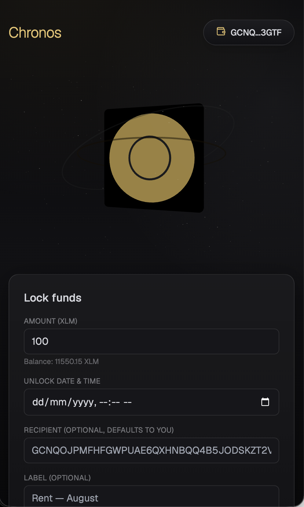
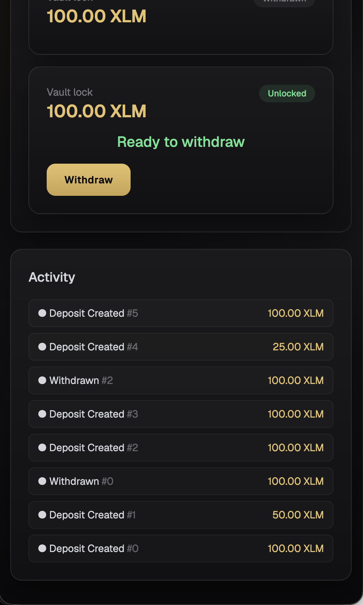
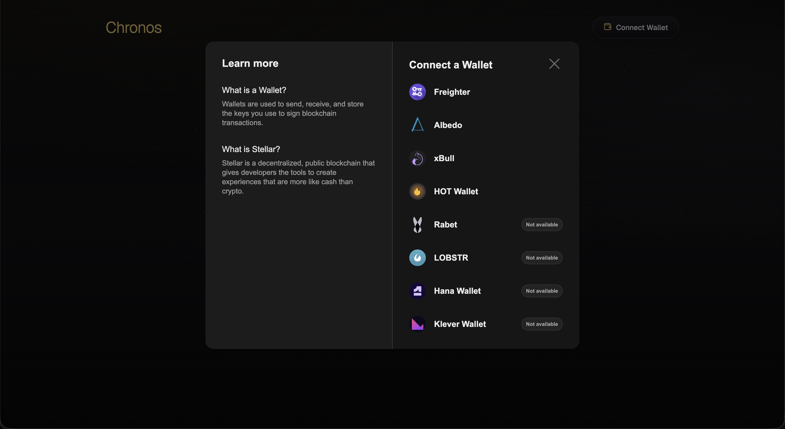
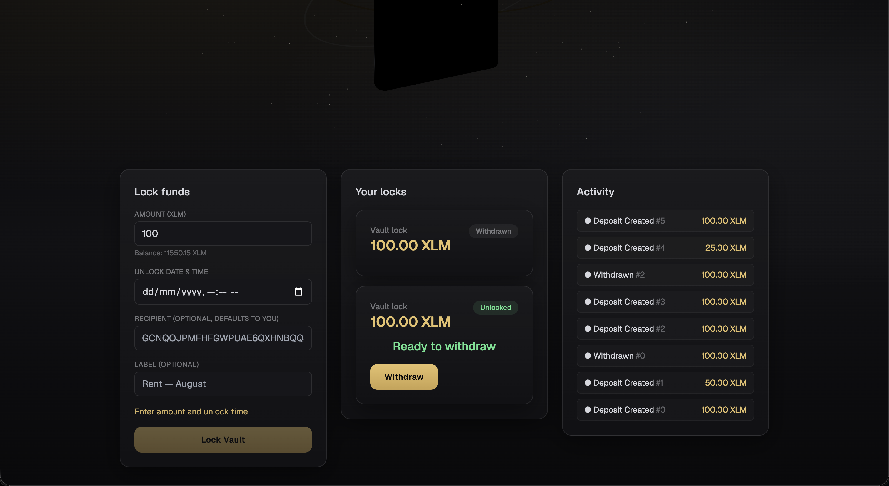

# Chronos — Time-Locked Vault on Stellar Soroban

Chronos is a time-locked vault dApp on Stellar Soroban. A user deposits XLM into an
on-chain vault and chooses an unlock timestamp; the contract makes withdrawal
provably impossible before that time and pays out via a real Vault → Token
inter-contract call the moment it arrives.

## Live Demo

**https://cronos.acid-surface-award.workers.dev/**

Deployed to Cloudflare Workers (static assets) from this repo, connected to the
same Stellar Testnet contract addresses recorded below.

## Demo Video (1–2 minutes)

Screen recording against the live deployment: connect wallet → deposit → live
countdown → unlock transition → withdraw.


## Contract Deployment Address

Deployed to **Stellar Testnet**:

```
CAZSJKXIA3MDEZ5FAI7MEAIWT27BZOSRUVAXOFAT2K2IH5NB2X7V6BDL
```

[View on Stellar Expert](https://stellar.expert/explorer/testnet/contract/CAZSJKXIA3MDEZ5FAI7MEAIWT27BZOSRUVAXOFAT2K2IH5NB2X7V6BDL)

Native XLM SAC address used as the vault's token (testnet):

```
CDLZFC3SYJYDZT7K67VZ75HPJVIEUVNIXF47ZG2FB2RMQQVU2HHGCYSC
```

## Transaction Hash for Contract Interaction

| # | Action | Tx Hash | Explorer |
|---|--------|---------|----------|
| 1 | `deposit` — 100 XLM, unlock in 120s, lock id 0 | `37d4b7f8502f049d34b0e9a1319076914f72a6532652c1af9e920a73df992d0d` | [View](https://stellar.expert/explorer/testnet/tx/37d4b7f8502f049d34b0e9a1319076914f72a6532652c1af9e920a73df992d0d) |
| 2 | `withdraw` — lock id 0, after unlock | `afc33fa54c26d88b09bdf6ecd8d54e6697f2c74215f4389c011d19d97835a255` | [View](https://stellar.expert/explorer/testnet/tx/afc33fa54c26d88b09bdf6ecd8d54e6697f2c74215f4389c011d19d97835a255) |
| 3 | `deposit` — 50 XLM, unlock in 7 days (long lock, active), lock id 1 | `1194f92bf1e8fc69f0e646d89f9e8106d9bdb719a47e15d92e7109eeaa94bb8f` | [View](https://stellar.expert/explorer/testnet/tx/1194f92bf1e8fc69f0e646d89f9e8106d9bdb719a47e15d92e7109eeaa94bb8f) |

All three hashes were verified to resolve on Stellar Expert (HTTP 200) before
being recorded here. Lock id 1 remains locked and is the live active countdown
referenced in the Definition of Done.

## Inter-Contract Communication

Chronos does not do internal balance bookkeeping. Every fund movement is a real
Soroban cross-contract call from the `vault` contract into the native XLM
Stellar Asset Contract (SAC), using `token::Client`:

- **Deposit custody**: `deposit()` calls
  `token::Client::new(&env, &token).transfer(&owner, &contract_address, &amount)`.
  This is visible as tx #1 above: the event log shows a `transfer` event from the
  SAC contract moving `1000000000` stroops from the depositor to the vault
  contract address, immediately followed by the vault's own `deposit` event.
- **Withdrawal payout**: `withdraw()` calls
  `token::Client::new(&env, &lock.token).transfer(&contract_address, &recipient, &amount)`.
  Tx #2's event log shows the SAC `transfer` event moving the same `1000000000`
  stroops back out of the vault contract to the recipient's account — a real,
  on-chain balance effect, not a simulated one.

See `contracts/vault/src/lib.rs` (`deposit`, `withdraw`) and
`contracts/vault/src/test.rs` (`test_withdraw_after_unlock_pays_exact_amount`,
which asserts the exact recipient balance delta against a real registered SAC
test contract).

## Event Streaming & Real-Time Updates

The contract emits two event types (`contracts/vault/src/events.rs`):

- `("vault", "deposit")` → `(id, owner, recipient, amount, unlock_at)`
- `("vault", "withdraw")` → `(id, recipient, amount)`

The frontend (`frontend/src/lib/events.ts`) polls `getEvents` on the Soroban RPC
every 5 seconds via SWR and renders them in the live activity timeline
(`frontend/src/components/ActivityTimeline.tsx`), newest first, each row linking
to Stellar Expert. Milestones (Timer Started / 25% / 50% / Ready to Withdraw) are
derived client-side from `created_at`/`unlock_at` rather than emitted on-chain.
The countdown itself ticks every second purely client-side from `unlock_at` — no
polling needed for the clock — and the progress ring interpolates continuously
via a Framer Motion spring rather than stepping once per poll.

## Smart Contract Deployment Workflow

Exact commands used for the deployment and transactions recorded above:

```bash
# 1. Identity + funding
stellar keys generate deployer --network testnet --fund

# 2. Build
stellar contract build

# 3. Deploy
stellar contract deploy \
  --wasm target/wasm32v1-none/release/vault.wasm \
  --source deployer \
  --network testnet \
  --alias vault

# 4. Native XLM SAC address
stellar contract id asset --asset native --network testnet

# 5. Deposit #1 (100 XLM, unlock in 120s)
stellar contract invoke --id vault --source deployer --network testnet -- deposit \
  --owner <DEPLOYER_ADDRESS> --recipient <DEPLOYER_ADDRESS> \
  --token <NATIVE_SAC_ADDRESS> --amount 1000000000 \
  --unlock_at <NOW+120> --label "Demo lock"

# 6. Withdraw #2 (after unlock time passes)
stellar contract invoke --id vault --source deployer --network testnet -- withdraw --id 0

# 7. Deposit #3 (50 XLM, unlock in 7 days — stays active)
stellar contract invoke --id vault --source deployer --network testnet -- deposit \
  --owner <DEPLOYER_ADDRESS> --recipient <DEPLOYER_ADDRESS> \
  --token <NATIVE_SAC_ADDRESS> --amount 500000000 \
  --unlock_at <NOW+604800> --label "Long lock demo"
```

Frontend env vars (`frontend/.env.example`, also required in the Cloudflare
dashboard before deploying):

```
NEXT_PUBLIC_VAULT_CONTRACT_ADDRESS=CAZSJKXIA3MDEZ5FAI7MEAIWT27BZOSRUVAXOFAT2K2IH5NB2X7V6BDL
NEXT_PUBLIC_TOKEN_CONTRACT_ADDRESS=CDLZFC3SYJYDZT7K67VZ75HPJVIEUVNIXF47ZG2FB2RMQQVU2HHGCYSC
NEXT_PUBLIC_STELLAR_NETWORK=testnet
NEXT_PUBLIC_STELLAR_RPC_URL=https://soroban-testnet.stellar.org:443
```

## CI/CD Pipeline

`.github/workflows/ci.yml` runs two jobs on every push/PR to `main`:

- `contracts`: installs the Rust `wasm32v1-none` target, runs `cargo test
  --workspace`, then `cargo build --release --target wasm32v1-none -p vault`
  to produce the deployable wasm.
- `frontend`: Node 20, `npm ci`, `npm run lint`, `npm run build` in `frontend/`.

Live at [github.com/krven441/cronos/actions](https://github.com/krven441/cronos/actions).

## Tests

`cargo test -p vault` — 8 tests, all real, run against a registered SAC test
token so balance assertions reflect actual inter-contract transfer effects:

```
running 8 tests
test test::test_deposit_validation_zero_amount - should panic ... ok
test test::test_deposit_validation_past_unlock - should panic ... ok
test test::test_withdraw_before_unlock_fails - should panic ... ok
test test::test_withdraw_wrong_address_fails - should panic ... ok
test test::test_deposit_locks_funds ... ok
test test::test_double_withdraw_fails - should panic ... ok
test test::test_time_remaining ... ok
test test::test_withdraw_after_unlock_pays_exact_amount ... ok

test result: ok. 8 passed; 0 failed; 0 ignored; 0 measured; 0 filtered out; finished in 0.09s
```

Coverage: locking funds, rejecting early withdrawal, exact-amount payout via a
real SAC balance delta, rejecting a non-recipient withdrawer, rejecting a double
withdrawal, rejecting invalid deposits (zero amount, past unlock time), and
`time_remaining` returning correct values before/after unlock.

## Error Handling & Loading States

Four distinct, individually styled states, all wired in
`frontend/src/components/`:

1. **Wallet not found** (`WalletMissingBanner.tsx`) — broken-chain icon + link to
   install Freighter, shown when `StellarWalletsKit.openModal` reports no
   extension detected.
2. **Rejected signature** (`CreateLockForm.tsx`, `LockCard.tsx`) — non-blaming
   "Transaction declined in wallet" message with a red shake on the action
   button, detected via `isUserRejection`.
3. **Insufficient balance** (`CreateLockForm.tsx`) — pre-flight check (amount +
   1 XLM fee headroom vs. live balance) before submission; amount field shakes,
   clear shortfall message.
4. **Still locked** (`LockCard.tsx`) — withdrawing before `unlock_at` shows a
   tooltip with the exact remaining time instead of submitting; the button stays
   visually sealed until unlock.

Loading states: skeleton/shimmer placeholders for the locks list and activity
timeline while SWR is fetching (never a blank screen), and an animated empty
state (`EmptyVault.tsx`) when a connected wallet has zero locks.

## Mobile Responsive Frontend

Verified at 375×812 (mobile) with no horizontal scroll: header wraps to a
single row, the 3D vault renders at reduced particle count (`VaultHero.tsx`
switches `reduced=true` under a 480px media query), and the grid layout
collapses from three columns to one below the `lg` breakpoint.

<table>
<tr>
<td><br/><sub>Connected wallet with balance</sub></td>
<td><br/><sub>Locks list and activity timeline</sub></td>
</tr>
</table>

## Production-Ready Architecture

- **No early-withdraw or cancel function, by design.** The contract exposes no
  path to move funds out of a lock before `unlock_at` — not even for the owner.
  This is the product: a lock that genuinely cannot be broken is the entire
  value proposition of a time-locked vault. Adding an escape hatch would defeat
  the guarantee the dApp exists to provide.
- **3D performance strategy**: the R3F scene caps particle count (~220 points,
  instanced via `<Points>`), uses `dpr={[1, 2]}` capped to `1` on narrow
  viewports, sets `frameloop="never"` when the tab is hidden
  (`document.visibilitychange`), and swaps to a reduced-particle scene under
  480px rather than hiding the vault entirely.
- **Storage**: persistent Soroban storage with explicit TTL bumps
  (`contracts/vault/src/storage.rs`) on both the per-lock entry and the
  per-owner index, so vault state and can survive the archival window without
  manual intervention.

## Setup Instructions

Contracts:

```bash
cd contracts/vault
cargo test
stellar contract build
```

Frontend:

```bash
cd frontend
cp .env.example .env.local   # or point at your own deployment
npm install
npm run dev
```

## Screenshots

All captured against the live deployment at
https://cronos.acid-surface-award.workers.dev/.

**Wallet options modal** — Freighter, Albedo, xBull, HOT Wallet available;
Rabet, LOBSTR, Hana, and Klever shown as not installed.



**Connected state, locks list, and activity timeline** — one withdrawn lock,
one unlocked lock ready for withdrawal, and the live event feed on the right.



**Mobile UI (375px)** — see [Mobile Responsive Frontend](#mobile-responsive-frontend) above.

**Demo recording** — see [Demo Video (1–2 minutes)](#demo-video-1-2-minutes) above.

CI/CD green run screenshot and `cargo test` output screenshot: pending, to be
added.
