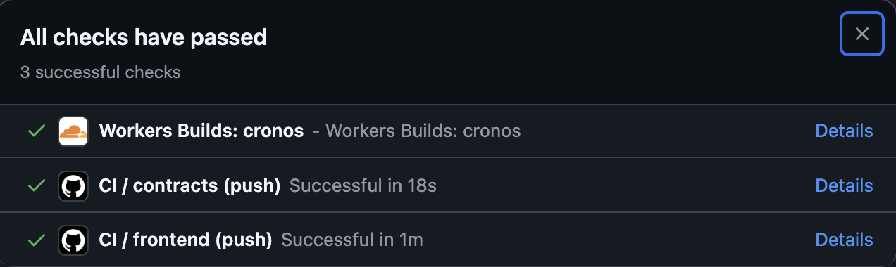
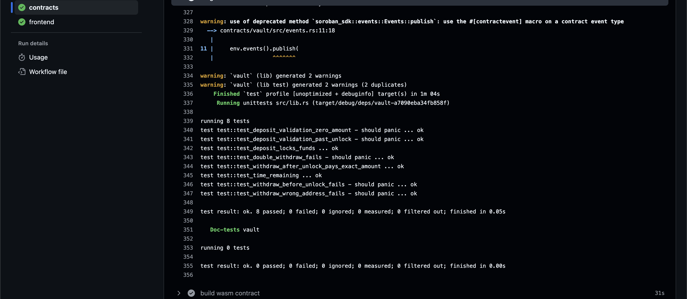

# ⏳ Chronos — Time-Locked Vault on Stellar Soroban

[](https://github.com/krven441/cronos/actions/workflows/ci.yml)
[](https://stellar.org)
[](https://soroban.stellar.org)
[](https://nextjs.org)
[](https://www.typescriptlang.org)
[](https://cronos.acid-surface-award.workers.dev/)
[](LICENSE)

<div align="center">

**A vault that makes withdrawal provably impossible until a chosen unlock time — enforced on-chain, paid out via a real Vault → Token inter-contract call.**

### 🔗 [Live Demo → cronos.acid-surface-award.workers.dev](https://cronos.acid-surface-award.workers.dev/)

</div>


## Table of Contents

- [Live Demo](#live-demo)
- [Demo Video (1–2 minutes)](#demo-video-12-minutes)
- [Project Description](#project-description)
- [Architecture](#architecture)
- [Tech Stack](#tech-stack)
- [Smart Contracts (Testnet)](#smart-contracts-testnet)
- [Inter-Contract Calls](#inter-contract-calls)
- [Wallet Connection](#wallet-connection)
- [Core Mechanics](#core-mechanics)
- [Event Streaming & Real-Time Updates](#event-streaming--real-time-updates)
- [Error Handling](#error-handling)
- [CI/CD Pipeline](#cicd-pipeline)
- [Testing](#testing)
- [Screenshots](#screenshots)
- [Setup Instructions](#setup-instructions)
- [Commit History Summary](#commit-history-summary)
- [License](#license)

---

## Live Demo

**<https://cronos.acid-surface-award.workers.dev/>** — deployed to Cloudflare Workers (static assets) from this repo, wired to the real testnet contract addresses below. Connect a testnet wallet, lock XLM, watch the countdown, withdraw once it hits zero.

## Demo Video (1–2 minutes)

Screen recording against the live deployment: connect wallet → deposit → live countdown → unlock transition → withdraw.


---

## Project Description

Chronos lets a user lock XLM in an on-chain vault until an unlock timestamp of
their choosing. Before the unlock time, withdrawal is impossible — the contract
rejects it outright, with no owner override and no cancel path. Once the
countdown reaches zero, the depositor (or a designated recipient) can withdraw,
triggering a real **Vault → Token** inter-contract transfer against the native
XLM Stellar Asset Contract (SAC).

**Key properties:**
- 🔒 **No early-withdraw path, by design** — the guarantee that funds are untouchable until unlock IS the product
- ⛓️ **Real inter-contract calls** — deposit custody and withdrawal payout are Soroban-to-Soroban `token::Client` invocations, not internal bookkeeping
- 📡 **Live event streaming** — contract events drive a real-time activity timeline, countdown, and progress ring
- 🎨 **Custom 3D vault hero** — React Three Fiber scene with a mechanical flip-digit countdown and a smooth progress ring

---

## Architecture

```
┌──────────────────────────────────────────────────────────┐
│                      User Browser                         │
│                                                            │
│  ┌──────────────────────────────────────────────────┐    │
│  │          Next.js 14 Frontend (TypeScript)         │    │
│  │                                                    │    │
│  │  WalletButton │ CreateLockForm │ LockCard          │    │
│  │  VaultHero (R3F) │ Countdown │ ActivityTimeline    │    │
│  └──────────┬───────────────────────┬─────────────────┘    │
│             │  Wallet Signing        │  Soroban RPC         │
│             ▼                        ▼                     │
│  ┌──────────────────┐    ┌──────────────────────────┐     │
│  │ StellarWalletsKit│    │  lib/contract.ts          │     │
│  │ (Freighter etc.) │    │  TransactionBuilder +      │     │
│  └──────────────────┘    │  simulateTransaction /      │    │
│                          │  sendTransaction / getEvents │    │
│                          └────────────┬─────────────────┘   │
└───────────────────────────────────────┼─────────────────────┘
                                        │ HTTPS / Soroban RPC
                                        ▼
                             ┌─────────────────────┐
                             │   Stellar Testnet    │
                             │   (Soroban RPC)      │
                             └──────────┬───────────┘
                                        │
                          ┌─────────────┴──────────────┐
                          │                             │
                          ▼                             │
             ┌────────────────────────┐                │
             │   Vault Contract       │                │
             │   CAZSJKXIA3MDEZ5...   │                │
             │                        │                │
             │  deposit()      ───────┼──┐             │
             │  withdraw()     ───────┼──┤ Inter-      │
             │  get_lock()            │  │ Contract    │
             │  get_locks_for()       │  │ Calls       │
             │  time_remaining()      │  │             │
             └────────────────────────┘  │             │
                                         ▼             │
             ┌────────────────────────────────────┐    │
             │   Native XLM SAC (Token Contract)  │◄───┘
             │   CDLZFC3SYJYDZT7K67VZ75...         │
             │                                    │
             │  transfer(from, to, amount) ◄──────┘
             │  balance(address)
             └────────────────────────────────────┘
```

---

## Tech Stack

| Layer | Technology |
|---|---|
| Smart contracts | Rust + Soroban SDK 27, `wasm32v1-none` target |
| Frontend framework | Next.js 14 (App Router), static export |
| Language | TypeScript |
| Styling | Tailwind CSS |
| Wallet integration | `@creit.tech/stellar-wallets-kit` |
| Stellar SDK | `@stellar/stellar-sdk` v16 |
| Motion | Framer Motion |
| 3D | React Three Fiber + drei |
| Data polling | SWR |
| Frontend testing | Vitest |
| Icons | lucide-react |
| Deployment | Cloudflare Workers (static assets) |
| CI/CD | GitHub Actions |

---

## Smart Contracts (Testnet)

| Contract | Address | Stellar Expert |
|---|---|---|
| **Vault** | `CAZSJKXIA3MDEZ5FAI7MEAIWT27BZOSRUVAXOFAT2K2IH5NB2X7V6BDL` | [View ↗](https://stellar.expert/explorer/testnet/contract/CAZSJKXIA3MDEZ5FAI7MEAIWT27BZOSRUVAXOFAT2K2IH5NB2X7V6BDL) |
| **Native XLM SAC** (token) | `CDLZFC3SYJYDZT7K67VZ75HPJVIEUVNIXF47ZG2FB2RMQQVU2HHGCYSC` | [View ↗](https://stellar.expert/explorer/testnet/contract/CDLZFC3SYJYDZT7K67VZ75HPJVIEUVNIXF47ZG2FB2RMQQVU2HHGCYSC) |

### Contract Addresses in Environment Config

```env
NEXT_PUBLIC_VAULT_CONTRACT_ADDRESS=CAZSJKXIA3MDEZ5FAI7MEAIWT27BZOSRUVAXOFAT2K2IH5NB2X7V6BDL
NEXT_PUBLIC_TOKEN_CONTRACT_ADDRESS=CDLZFC3SYJYDZT7K67VZ75HPJVIEUVNIXF47ZG2FB2RMQQVU2HHGCYSC
NEXT_PUBLIC_STELLAR_NETWORK=testnet
NEXT_PUBLIC_STELLAR_RPC_URL=https://soroban-testnet.stellar.org:443
```

---

## Inter-Contract Calls

Chronos does not do internal balance bookkeeping. Every fund movement is a real
Soroban cross-contract call from the `vault` contract into the native XLM
Stellar Asset Contract (SAC), using the standard Soroban typed token client.

#### During `deposit()` — locking funds into the vault

```rust
// In contracts/vault/src/lib.rs → deposit()
// Inter-contract call: pull the deposit from the owner into the vault (custody)
let token_client = token::Client::new(&env, &token);
token_client.transfer(&owner, &env.current_contract_address(), &amount);
```

#### During `withdraw()` — releasing funds to the recipient

```rust
// In contracts/vault/src/lib.rs → withdraw()
// Inter-contract call: push the locked amount from the vault to the recipient
let token_client = token::Client::new(&env, &lock.token);
token_client.transfer(
    &env.current_contract_address(),
    &lock.recipient,
    &lock.amount,
);
```

The SDK call used is `token::Client::new(&env, &token_address).transfer(&from, &to, &amount)` — the standard Soroban typed client for cross-contract invocation.

### Transaction Hash Evidence

| # | Action | Transaction Hash | Stellar Expert |
|---|--------|-------------------|-----------------|
| 1 | `deposit` — 100 XLM, unlock in 120s, lock id 0 | `37d4b7f8502f049d34b0e9a1319076914f72a6532652c1af9e920a73df992d0d` | [View ↗](https://stellar.expert/explorer/testnet/tx/37d4b7f8502f049d34b0e9a1319076914f72a6532652c1af9e920a73df992d0d) |
| 2 | `withdraw` — lock id 0, after unlock | `afc33fa54c26d88b09bdf6ecd8d54e6697f2c74215f4389c011d19d97835a255` | [View ↗](https://stellar.expert/explorer/testnet/tx/afc33fa54c26d88b09bdf6ecd8d54e6697f2c74215f4389c011d19d97835a255) |
| 3 | `deposit` — 50 XLM, unlock in 7 days (long lock, active), lock id 1 | `1194f92bf1e8fc69f0e646d89f9e8106d9bdb719a47e15d92e7109eeaa94bb8f` | [View ↗](https://stellar.expert/explorer/testnet/tx/1194f92bf1e8fc69f0e646d89f9e8106d9bdb719a47e15d92e7109eeaa94bb8f) |

> All three hashes were verified to resolve on Stellar Expert (HTTP 200) before being recorded here. Tx #2's event log shows the SAC `transfer` event moving `1000000000` stroops back out of the vault contract to the recipient — a real, on-chain balance effect, not a simulated one. Lock id 1 remains locked and is the live active countdown on the deployed site.

See `contracts/vault/src/lib.rs` (`deposit`, `withdraw`) and
`contracts/vault/src/test.rs` (`test_withdraw_after_unlock_pays_exact_amount`,
which asserts the exact recipient balance delta against a real registered SAC
test contract).

---

## Wallet Connection

Wallet integration is handled by `@creit.tech/stellar-wallets-kit`
(StellarWalletsKit), which provides a multi-wallet selection modal —
Freighter, Albedo, xBull, HOT Wallet, Rabet, LOBSTR, Hana, and Klever.
**Freighter** is the primary tested path.

**Connection flow:**
1. User clicks "Connect Wallet" → `WalletButton.tsx` opens the
   StellarWalletsKit modal via `kit.openModal()`
2. On selection, `kit.setWallet(option.id)` then `kit.getAddress()` retrieves
   the public key, stored in React state, which triggers balance and locks
   fetches
3. The top nav shows a truncated address (e.g. `GCNQ...3GTF`) as a metallic
   capsule button
4. Clicking it again calls `kit.disconnect()` and clears state, returning to
   the disconnected view

If no extension is detected, `openModal` reports it and
`WalletMissingBanner.tsx` renders a dedicated error state instead of a raw
exception (see [Error Handling](#error-handling)).

---

## Core Mechanics

### Lock Lifecycle

A lock moves through exactly two states: `Locked` → `Withdrawn`. There is no
third path — no cancel, no early exit, no partial withdrawal. The contract
enforces this with a single check in `withdraw()`:

```rust
// In contracts/vault/src/lib.rs → withdraw()
let now = env.ledger().timestamp();
if now < lock.unlock_at {
    panic!("still locked");
}
```

### Countdown & Progress Ring (client-side)

The frontend never polls the chain for a per-second clock — that would be
wasteful RPC traffic. Instead `unlock_at` is fetched once and the countdown
runs entirely client-side, ticking every second:

```ts
// In frontend/src/lib/time.ts — breakdown(), called every second
const remainingSeconds = Math.max(0, unlockAt - Math.floor(Date.now() / 1000));
const days = Math.floor(remainingSeconds / 86400);
const hours = Math.floor((remainingSeconds % 86400) / 3600);
const minutes = Math.floor((remainingSeconds % 3600) / 60);
const seconds = remainingSeconds % 60;
```

The progress ring (elapsed vs. total lock duration) is computed the same way
from `created_at`/`unlock_at` and animated with a Framer Motion spring so it
interpolates continuously instead of stepping once per poll.

---

## Event Streaming & Real-Time Updates

The contract emits two event types (`contracts/vault/src/events.rs`):

- `("vault", "deposit")` → `(id, owner, recipient, amount, unlock_at)`
- `("vault", "withdraw")` → `(id, recipient, amount)`

The frontend (`frontend/src/lib/events.ts`) polls `getEvents` on the Soroban
RPC every 5 seconds via SWR and renders them in the live activity timeline
(`frontend/src/components/ActivityTimeline.tsx`), newest first, each row
linking to Stellar Expert. Milestones (Timer Started / 25% / 50% / Ready to
Withdraw) are derived client-side from `created_at`/`unlock_at` rather than
emitted on-chain.

---

## Error Handling

Four distinct, individually styled states, all wired in
`frontend/src/components/`:

### 1. 🔌 Wallet Not Found
Shown when `StellarWalletsKit.openModal` reports no extension detected
(`WalletMissingBanner.tsx`) — broken-chain icon + link to install Freighter.

### 2. 🚫 Rejected Signature
If the user declines to sign in their wallet, `isUserRejection()` catches it
and shows a non-blaming "Transaction declined in wallet" message with a red
shake on the action button (`CreateLockForm.tsx`, `LockCard.tsx`).

### 3. 💰 Insufficient Balance
A pre-flight check (amount + 1 XLM fee headroom vs. live balance) runs before
submission in `CreateLockForm.tsx`; the amount field shakes with a clear
shortfall message.

### 4. 🔒 Still Locked
Withdrawing before `unlock_at` shows a tooltip with the exact remaining time
instead of submitting a doomed transaction (`LockCard.tsx`); the button stays
visually sealed until unlock.

**Loading states**: skeleton/shimmer placeholders for the locks list and
activity timeline while SWR is fetching (never a blank screen), and an
animated empty state (`EmptyVault.tsx`) when a connected wallet has zero
locks.

---

## CI/CD Pipeline

`.github/workflows/ci.yml` runs two jobs on every push/PR to `main`:

- `contracts`: installs the Rust `wasm32v1-none` target, runs `cargo test --workspace`, then `cargo build --release --target wasm32v1-none -p vault` to produce the deployable wasm.
- `frontend`: Node 20, `npm install`, `npm run lint`, `npm test`, `npm run build` in `frontend/`.

Live at [github.com/krven441/cronos/actions](https://github.com/krven441/cronos/actions).



---

## Testing

**Contracts** — `cargo test -p vault`, 8 tests, all real, run against a
registered SAC test token so balance assertions reflect actual inter-contract
transfer effects:

```
running 8 tests
test test::test_deposit_validation_zero_amount - should panic ... ok
test test::test_deposit_validation_past_unlock - should panic ... ok
test test::test_withdraw_before_unlock_fails - should panic ... ok
test test::test_withdraw_wrong_address_fails - should panic ... ok
test test::test_deposit_locks_funds ... ok
test test::test_double_withdraw_fails - should panic ... ok
test test::test_time_remaining ... ok
test test::test_withdraw_after_unlock_pays_exact_amount ... ok

test result: ok. 8 passed; 0 failed; 0 ignored; 0 measured; 0 filtered out; finished in 0.09s
```



Coverage: locking funds, rejecting early withdrawal, exact-amount payout via a
real SAC balance delta, rejecting a non-recipient withdrawer, rejecting a
double withdrawal, rejecting invalid deposits (zero amount, past unlock time),
and `time_remaining` returning correct values before/after unlock.

**Frontend** — `npm test` (Vitest), 18 tests across
`frontend/src/lib/__tests__/`, covering the countdown time-breakdown math
(`time.ts`), stroop/XLM unit conversion (`balance.ts`), and the wallet
error-classification logic that drives the wallet-not-found and
rejected-signature error states (`wallet.ts`). Runs in CI alongside lint and
build.

---

## Screenshots

All captured against the live deployment at
<https://cronos.acid-surface-award.workers.dev/>.

**Wallet options modal** — Freighter, Albedo, xBull, HOT Wallet available;
Rabet, LOBSTR, Hana, and Klever shown as not installed.


**Connected state, locks list, and activity timeline** — one withdrawn lock,
one unlocked lock ready for withdrawal, and the live event feed on the right.


**Mobile UI (375px)** — no horizontal scroll, single-column layout, reduced-particle 3D vault.

<table>
<tr>
<td><br/><sub>Connected wallet with balance</sub></td>
<td><br/><sub>Locks list and activity timeline</sub></td>
</tr>
</table>

**CI/CD green run** — see [CI/CD Pipeline](#cicd-pipeline) above.

**Test output** — see [Testing](#testing) above.

**Demo recording** — see [Demo Video (1–2 minutes)](#demo-video-12-minutes) above.

---

## Setup Instructions

Contracts:

```bash
cd contracts/vault
cargo test
stellar contract build
```

Frontend:

```bash
cd frontend
cp .env.example .env.local   # or point at your own deployment
npm install
npm run dev
```

**Production-ready notes:**
- **No early-withdraw or cancel function, by design** — the contract exposes no path to move funds out of a lock before `unlock_at`, not even for the owner. Adding an escape hatch would defeat the guarantee the dApp exists to provide.
- **3D performance strategy** — the R3F scene caps particle count (~220 points, instanced via `<Points>`), uses `dpr={[1, 2]}` capped to `1` on narrow viewports, sets `frameloop="never"` when the tab is hidden (`document.visibilitychange`), and swaps to a reduced-particle scene under 480px.
- **Storage** — persistent Soroban storage with explicit TTL bumps (`contracts/vault/src/storage.rs`) on both the per-lock entry and the per-owner index.

---

## Commit History Summary

This project was built incrementally in meaningful commits reflecting real progressive development stages:

| # | Commit Message |
|---|---------------|
| 1 | `chore: project scaffold (Next.js + Soroban workspace)` |
| 2 | `feat: vault contract data model and storage` |
| 3 | `feat: deposit with token custody via inter-contract transfer` |
| 4 | `feat: time-gated withdraw with Vault->Token payout` |
| 5 | `feat: contract events for deposit/withdraw` |
| 6 | `test: vault unit tests (8 passing, real inter-contract balance assertions)` |
| 7 | `feat: wallet connect/disconnect via StellarWalletsKit` |
| 8 | `feat: design system (palette, typography, tactile buttons, premium cards)` |
| 9 | `feat: 3D vault core hero with rotating rings and particles (R3F)` |
| 10 | `feat: mechanical flip countdown and smooth progress ring` |
| 11 | `feat: deposit flow with transaction status tracking and lock animation` |
| 12 | `feat: withdraw flow with unlock animation` |
| 13 | `feat: live activity timeline from contract events` |
| 14 | `feat: error handling (wallet missing, rejected signature, insufficient balance, still locked)` |
| 15 | `ci: GitHub Actions pipeline for contracts + frontend` |
| 16 | `chore: testnet deployment + real contract addresses wired in` |
| 17 | `docs: README with full evidence (addresses, tx hashes, screenshots)` |
| 18 | `test: add frontend unit tests (Vitest); chore: add MIT LICENSE` |

Plus 10 follow-up fix/docs commits (dependency and CI reliability fixes,
screenshot integration, README structure) — full history:
[View on GitHub ↗](https://github.com/krven441/cronos/commits/main)

---

## License

[MIT](LICENSE)
